# Microsoft Certified Server Administrator - Project 2


*This project is created by Muhmedsadiq A. Jasim \| LinkedIn: <https://www.linkedin.com/in/muhmedsadiqjasim/>*

June 13, 2026

# **Table of Contents**

[Project Requirements [2](#project-requirements)](#project-requirements)

[IP Addressing Table [4](#ip-addressing-table)](#ip-addressing-table)

[Resources Table [4](#resources-table)](#resources-table)

[Users, Computers, IPs, and Groups Table [4](#users-computers-ips-and-groups-table)](#users-computers-ips-and-groups-table)

[Creating Domain Environment [5](#creating-domain-environment)](#creating-domain-environment)

[Creating a Second Server [7](#creating-a-second-server)](#creating-a-second-server)

[Configuring DNS [10](#configuring-dns)](#configuring-dns)

[ADDS – Users and Computers [11](#adds-users-and-computers)](#adds-users-and-computers)

[Group Policy Management [13](#group-policy-management)](#group-policy-management)

[Password and Lockout Policies [13](#password-and-lockout-policies)](#password-and-lockout-policies)

[Enabling RDP for Remote Desktop Connection [14](#enabling-rdp-for-remote-desktop-connection)](#enabling-rdp-for-remote-desktop-connection)

[Enabling Remote Assistance [15](#enabling-remote-assistance)](#enabling-remote-assistance)

[Prohibiting access to Removable Storage, Task Manager and Control Panel [16](#prohibiting-access-to-removable-storage-task-manager-and-control-panel)](#prohibiting-access-to-removable-storage-task-manager-and-control-panel)

[Configuring DHCP [17](#configuring-dhcp)](#configuring-dhcp)

[DHCP Scope [17](#dhcp-scope)](#dhcp-scope)

[DHCP Failover [18](#dhcp-failover)](#dhcp-failover)

[Web Server Internet Information Services (IIS) [19](#web-server-internet-information-services-iis)](#web-server-internet-information-services-iis)

[Sharing and File Server Resource Manager (FSRM) [20](#sharing-and-file-server-resource-manager-fsrm)](#sharing-and-file-server-resource-manager-fsrm)

[Map Network Drive [21](#map-network-drive)](#map-network-drive)

[Public Shared Folder and Quota [22](#public-shared-folder-and-quota)](#public-shared-folder-and-quota)

[Printer Configuration [23](#printer-configuration)](#printer-configuration)

[Active Directory Administrative Center - Active Directory Recycle Bin [24](#active-directory-administrative-center---active-directory-recycle-bin)](#active-directory-administrative-center---active-directory-recycle-bin)

[Virtualization with Hyper-V [25](#virtualization-with-hyper-v)](#virtualization-with-hyper-v)

[Installing Hyper-V [25](#installing-hyper-v)](#installing-hyper-v)

[Creating Windows Server VM in Hyper-V [26](#creating-windows-server-vm-in-hyper-v)](#creating-windows-server-vm-in-hyper-v)

[Configuring Hyper-V Replica [27](#configuring-hyper-v-replica)](#configuring-hyper-v-replica)

[Windows Server Backup [28](#windows-server-backup)](#windows-server-backup)

[Windows Deployment Services [29](#windows-deployment-services)](#windows-deployment-services)

[Windows Server Update Services [31](#windows-server-update-services)](#windows-server-update-services)

[Transfer and Seize FSMO Master Roles (Explain) [32](#transfer-and-seize-fsmo-master-roles-explain)](#transfer-and-seize-fsmo-master-roles-explain)

[Verifying (Clients View) [33](#verifying-clients-view)](#verifying-clients-view)

[MESSAGE FOR YOU! [38](#message-for-you)](#message-for-you)

# **Project Requirements**

- Create a domain environment with the domain name **COMPANY.LOCAL** on a server named **PDC** with IP address **192.168.50.10/24** and gateway **192.168.50.1**.

- Create a second server named **ADC-CORE** using **Windows Server Core** with IP address **192.168.50.11/24** and make it an **Additional Domain Controller**.

- Create separate OUs for each department: **HR, Sales, Dev, IT, Finance**.

- Inside each department OU, create two sub-OUs: **Users** and **Computers**.

- Create users in each department, create one security group for each department, and add users to the correct department group.

- Configure password policy:

  - Maximum password age: **60 days**

  - Minimum password length: **8 characters**

  - Password complexity: **Enabled**

  - Password history: **Remember last 5 passwords**

- Configure account lockout policy:

  - Lock account after **5 wrong password attempts**

  - Lockout duration: **45 minutes**

- Enable **Remote Desktop** for all domain computers using Group Policy.

- Allow **Remote Assistance** for all computers and assign the **IT Support Group** as helpers.

- Prohibit access to:

  - External/removable storage

  - Task Manager

  - Control Panel

- Create DHCP scope:

  - Scope range: **192.168.50.50 – 192.168.50.220**

  - Excluded range: **192.168.50.80 – 192.168.50.90**

  - Lease duration: **8 days**

- Configure DHCP failover between **PDC** and **ADC-CORE**.

- Install **IIS Web Server** on both PDC and ADC-CORE with the default IIS page.

- Configure DNS load balancing for:

www.company.local

Point it to:

192.168.50.10

192.168.50.11

- Create shared folders for **HR** and **Dev**:

  - Users can create and edit files.

  - Users cannot delete files.

  - Block audio, video, and executable files.

- Create mapped network drives for **HR** and **Dev** departments using Group Policy.

- Create a public shared folder for all domain users:

  - All domain users can edit.

  - Each user has a maximum quota of **2 GB**.

- Add a printer for all domain users:

  - Black and white printing only.

  - Printer available from **9:00 AM to 4:00 PM** only.

- Enable **Active Directory Recycle Bin**.

- Install **Hyper-V role** on PDC and ADC-CORE.

  - Create a Windows Server Core VM on PDC named **CORE-VM01**.

  - Configure **Hyper-V Replica** from PDC to ADC-CORE for CORE-VM01.

  - Join client machines to the domain.

<!-- -->

- Create a System state backup every day at **11:00 PM** for PDC, and save the backup destination on ADC-CORE.

- Install and configure **WDS** on **PDC**.

  - Add a Windows boot image and install image to WDS.

  - Test PXE boot from one client computer.

  - Deploy Windows to one test client using WDS.

- Install and configure **WSUS** on **PDC**.

  - Configure WSUS to download updates for Windows Server and Windows 11.

  - Create a GPO to point clients to the WSUS server.

  - Test updates on one client computer.

- Explain how to **transfer** and **seize** **FSMO Master Roles**.

## **IP Addressing Table**

| Device             | Hostname          | Role                                                           | IP Address                     | Gateway      | DNS                           |
|--------------------|-------------------|----------------------------------------------------------------|--------------------------------|--------------|-------------------------------|
| Router             | GATEWAY           | Default gateway                                                | 192.168.50.1                   | —            | —                             |
| Main Server        | PDC               | Primary DC, DNS, DHCP, IIS, File Server, Print Server, Hyper-V | 192.168.50.10                  | 192.168.50.1 | 127.0.0.1 / 192.168.50.11     |
| Second Server      | ADC               | Additional DC, DNS, DHCP Failover, IIS, Hyper-V Replica        | 192.168.50.11                  | 192.168.50.1 | 192.168.50.10 / 127.0.0.1     |
| Nested Core VM     | CORE-VM01         | Test VM for Hyper-V Replica                                    | 192.168.50.12                  | 192.168.50.1 | 192.168.50.10                 |
| Printer            | PRN-01            | Shared printer                                                 | 192.168.50.30                  | 192.168.50.1 | 192.168.50.10                 |
| DHCP Scope         | DHCP-SCOPE        | Client IP range                                                | 192.168.50.50 – 192.168.50.220 | 192.168.50.1 | 192.168.50.10 / 192.168.50.11 |
| DHCP Exclusion     | EXCLUDED-RANGE    | Reserved / excluded IPs                                        | 192.168.50.80 – 192.168.50.90  | —            | —                             |
| DNS Website Record | www.company.local | DNS round-robin record 1                                       | 192.168.50.10                  | —            | —                             |
| DNS Website Record | www.company.local | DNS round-robin record 2                                       | 192.168.50.11                  | —            | —                             |

## **Resources Table**

| Device                    | RAM       | CPU          | Notes                                                                |
|---------------------------|-----------|--------------|----------------------------------------------------------------------|
| PDC                       | 4 GB      | 4 cores      | Main server, AD, DNS, DHCP, IIS, File Server, Print Server, Hyper-V  |
| ADC-CORE                  | 2 GB      | 2 cores      | Server Core, Additional DC, DNS, DHCP failover, IIS, Hyper-V Replica |
| PC-01                     | 4 GB      | 4 cores      | Main testing client for IT policies                                  |
| CORE-VM01                 | 2 GB      | 2 cores      | Nested VM inside PDC-CX for Hyper-V Replica test                     |
| Total physical host usage | **10 GB** | **10 cores** | *CORE-VM01 uses resources from inside PDC-CX*                        |

## **Users, Computers, IPs, and Groups Table**

| OU      | User Full Name | Username      | Computer Name | Computer IP | Group       |
|---------|----------------|---------------|---------------|-------------|-------------|
| HR      | Ali Hassan     | ali.hassan    | PC-01         | DHCP        | HR-Group    |
| HR      | Sara Ahmed     | sara.ahmed    | PC-02         | DHCP        | HR-Group    |
| Sales   | Omar Khalid    | omar.khalid   | PC-03         | DHCP        | Sales-Group |
| Sales   | Noor Salim     | noor.salim    | PC-04         | DHCP        | Sales-Group |
| Dev     | Mustafa Karim  | mustafa.karim | PC-05         | DHCP        | Dev-Group   |
| Dev     | Zainab Ali     | zainab.ali    | PC-06         | DHCP        | Dev-Group   |
| IT      | Muhmedsadiq    | muhmedsadiq   | PC-07         | DHCP        | IT-Group    |
| IT      | Lina Nabil     | lina.nabil    | PC-08         | DHCP        | IT-Group    |
| Finance | Ahmed Yasin    | ahmed.yasin   | PC-09         | DHCP        | Fin-Group   |
| Finance | Huda Sami      | huda.sami     | PC-10         | DHCP        | Fin-Group   |

# **Creating Domain Environment** 

- Create a domain environment with the domain name **COMPANY.LOCAL** on a server named **PDC** with IP address **192.168.50.10/24** and gateway **192.168.50.1**.

To create the domain environment, we have to install ADDS first from the Server Manager, but before that we have to make sure that we are using the correct:

1.  Date and Time Zone

2.  IP Address and Network

3.  Hostname

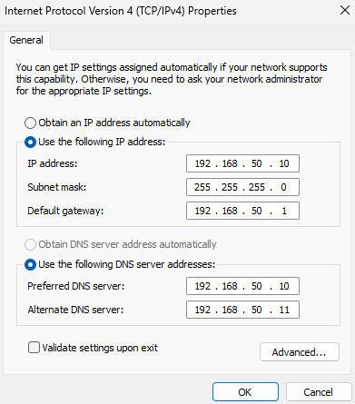

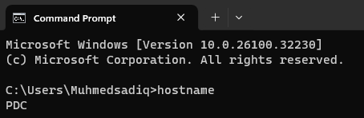

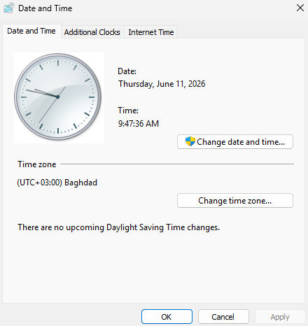

Now we can add ADDS from Server Manager

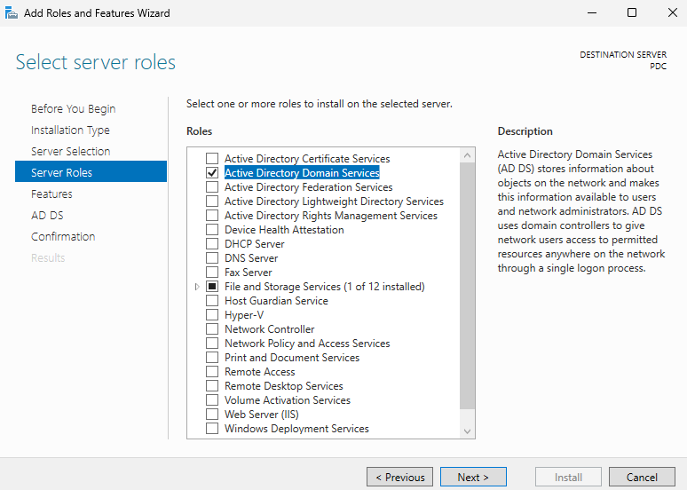

*If the Server Manager shows you an error about password, then you should add a password for the Administrator.*

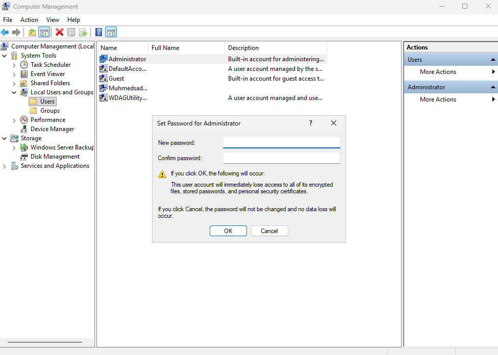

After promoting the ADDS now it’s the time to configure it.

**ADDS Configuration Wizard:**

1.  Add a new forest 🡪 company.local

2.  FFL & DFL 🡪 2016 \| DNS ✔️ GC ✔️

3.  DNS Delegation (Skip for now)

4.  NetBIOS 🡪 COMPANY

After restarting the ADDS will be added successfully.

# **Creating a Second Server**

- Create a second server named **ADC-CORE** using **Windows Server Core** with IP address **192.168.50.11/24** and make it an **Additional Domain Controller**.

Here we have to use **sconfig** command to configure our server and join to the domain, then we will have to install ADDS to make it an Additional Domain Controller.

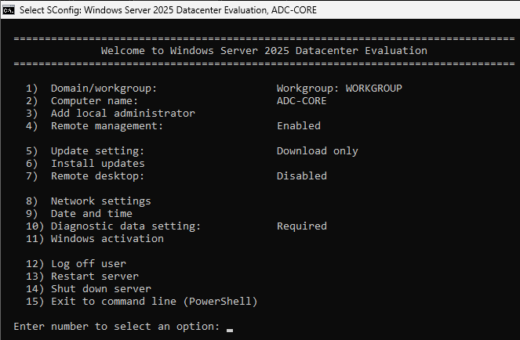

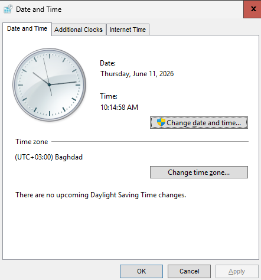

**Enabling Remote Management and Remote Desktop is very important**

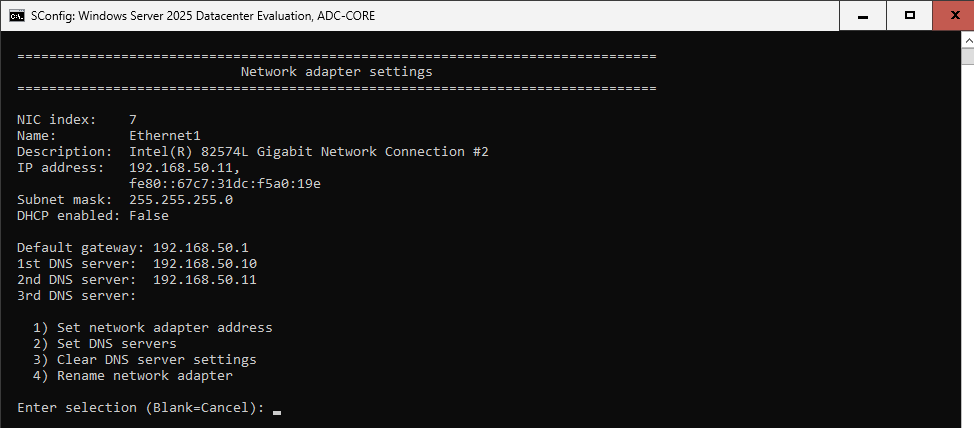

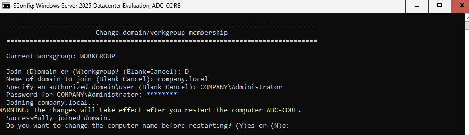

Now from PDC we have to add the ADC-CORE from Server Manager 🡪 Right-click on All Servers 🡪 Add Servers

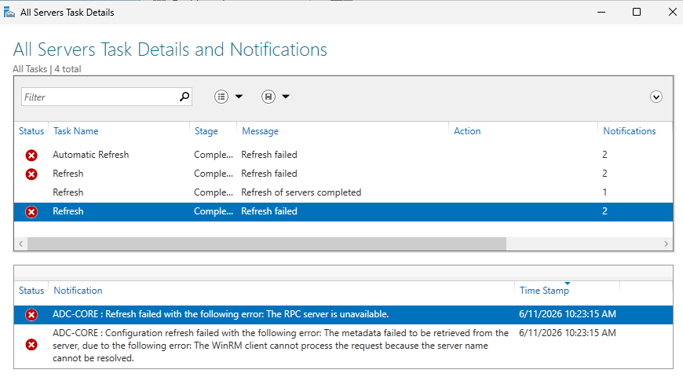

To solve this problem, we have to configure WinRM by using **winrm quickconfig** command on both devices, then we have to make sure that we are using the administrator account for this task.

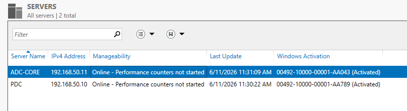

Now right-click on it and we can add the ADDS.

***<u>Don’t forget to use (Add a domain controller to an existing domain) when promoting.</u>***

DNS GC ✔️ \| Site: Default-First-Site-Name ✔️ \| Replica from: pdc.company.local ✔️

*Now we can say that we have ADC :)*

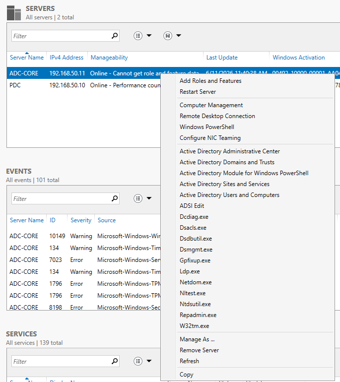

# **Configuring DNS**

- Configure DNS load balancing for:

www.company.local

Point it to:

192.168.50.10

192.168.50.11

On PDC 🡪 Server Manager 🡪 Tools 🡪 DNS 🡪 Click on PDC 🡪 Click on Forward Lookup Zone 🡪 Click on company.local:

Right-click 🡪 New Host (A or AAAA)

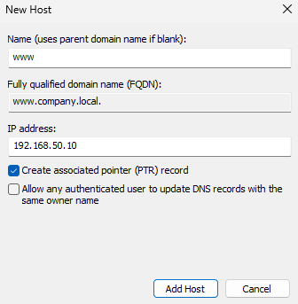

And same on 192.168.50.11.

Adding Forwarders (Google and Cloudflare), Right-click on PDC 🡪 Properties 🡪 Forwarders:

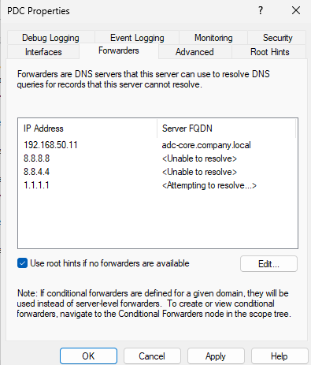

# **ADDS – Users and Computers**

We can use AI to make a script to add ADDS Objects faster. I used this script for this process:

```PowerShell
Import-Module ActiveDirectory
 
$DomainDN = (Get-ADDomain).DistinguishedName
$GroupsOU = "OU=Groups,$DomainDN"
$DefaultPassword = ConvertTo-SecureString "P@ssw0rd123!" -AsPlainText -Force
 
$Departments = @(
    @{ Name = "HR"; Group = "HR-Group" },
    @{ Name = "Sales"; Group = "Sales-Group" },
    @{ Name = "Dev"; Group = "Dev-Group" },
    @{ Name = "IT"; Group = "IT-Group" },
    @{ Name = "Finance"; Group = "Fin-Group" }
)
 
$Users = @(
    @{ Department="HR"; FirstName="Ali"; LastName="Hassan"; Username="ali.hassan"; Computer="PC-01"; Group="HR-Group" },
    @{ Department="HR"; FirstName="Sara"; LastName="Ahmed"; Username="sara.ahmed"; Computer="PC-02"; Group="HR-Group" },
    @{ Department="Sales"; FirstName="Omar"; LastName="Khalid"; Username="omar.khalid"; Computer="PC-03"; Group="Sales-Group" },
    @{ Department="Sales"; FirstName="Noor"; LastName="Salim"; Username="noor.salim"; Computer="PC-04"; Group="Sales-Group" },
    @{ Department="Dev"; FirstName="Mustafa"; LastName="Karim"; Username="mustafa.karim"; Computer="PC-05"; Group="Dev-Group" },
    @{ Department="Dev"; FirstName="Zainab"; LastName="Ali"; Username="zainab.ali"; Computer="PC-06"; Group="Dev-Group" },
    @{ Department="IT"; FirstName="Muhmedsadiq"; LastName=""; Username="muhmedsadiq"; Computer="PC-07"; Group="IT-Group" },
    @{ Department="IT"; FirstName="Lina"; LastName="Nabil"; Username="lina.nabil"; Computer="PC-08"; Group="IT-Group" },
    @{ Department="Finance"; FirstName="Ahmed"; LastName="Yasin"; Username="ahmed.yasin"; Computer="PC-09"; Group="Fin-Group" },
    @{ Department="Finance"; FirstName="Huda"; LastName="Sami"; Username="huda.sami"; Computer="PC-10"; Group="Fin-Group" }
)
 
if (-not (Get-ADOrganizationalUnit -LDAPFilter "(ou=Groups)" -SearchBase $DomainDN -SearchScope OneLevel -ErrorAction SilentlyContinue)) {
    New-ADOrganizationalUnit -Name "Groups" -Path $DomainDN -ProtectedFromAccidentalDeletion $false
}
 
foreach ($Dept in $Departments) {
    $DeptOU = "OU=$($Dept.Name),$DomainDN"
    $UsersOU = "OU=Users,$DeptOU"
    $ComputersOU = "OU=Computers,$DeptOU"
 
    if (-not (Get-ADOrganizationalUnit -LDAPFilter "(ou=$($Dept.Name))" -SearchBase $DomainDN -SearchScope OneLevel -ErrorAction SilentlyContinue)) {
        New-ADOrganizationalUnit -Name $Dept.Name -Path $DomainDN -ProtectedFromAccidentalDeletion $false
    }
 
    if (-not (Get-ADOrganizationalUnit -LDAPFilter "(ou=Users)" -SearchBase $DeptOU -SearchScope OneLevel -ErrorAction SilentlyContinue)) {
        New-ADOrganizationalUnit -Name "Users" -Path $DeptOU -ProtectedFromAccidentalDeletion $false
    }
 
    if (-not (Get-ADOrganizationalUnit -LDAPFilter "(ou=Computers)" -SearchBase $DeptOU -SearchScope OneLevel -ErrorAction SilentlyContinue)) {
        New-ADOrganizationalUnit -Name "Computers" -Path $DeptOU -ProtectedFromAccidentalDeletion $false
    }
 
    $ExistingGroup = Get-ADGroup -Identity $Dept.Group -ErrorAction SilentlyContinue
 
    if ($ExistingGroup) {
        Move-ADObject -Identity $ExistingGroup.DistinguishedName -TargetPath $GroupsOU -ErrorAction SilentlyContinue
    }
    else {
        New-ADGroup -Name $Dept.Group -SamAccountName $Dept.Group -GroupScope Global -GroupCategory Security -Path $GroupsOU
    }
}
 
foreach ($User in $Users) {
    $DeptOU = "OU=$($User.Department),$DomainDN"
    $UsersOU = "OU=Users,$DeptOU"
    $ComputersOU = "OU=Computers,$DeptOU"
    $FullName = "$($User.FirstName) $($User.LastName)".Trim()
 
    $ExistingUser = Get-ADUser -Filter "SamAccountName -eq '$($User.Username)'" -ErrorAction SilentlyContinue
 
    if ($ExistingUser) {
        Move-ADObject -Identity $ExistingUser.DistinguishedName -TargetPath $UsersOU -ErrorAction SilentlyContinue
    }
    else {
        if ($User.LastName -eq "") {
            New-ADUser -Name $FullName -GivenName $User.FirstName -SamAccountName $User.Username -UserPrincipalName "$($User.Username)@company.local" -Path $UsersOU -AccountPassword $DefaultPassword -Enabled $true -ChangePasswordAtLogon $false
        }
        else {
            New-ADUser -Name $FullName -GivenName $User.FirstName -Surname $User.LastName -SamAccountName $User.Username -UserPrincipalName "$($User.Username)@company.local" -Path $UsersOU -AccountPassword $DefaultPassword -Enabled $true -ChangePasswordAtLogon $false
        }
    }
 
    Add-ADGroupMember -Identity $User.Group -Members $User.Username -ErrorAction SilentlyContinue
 
    $ExistingComputer = Get-ADComputer -Filter "Name -eq '$($User.Computer)'" -ErrorAction SilentlyContinue
 
    if ($ExistingComputer) {
        Move-ADObject -Identity $ExistingComputer.DistinguishedName -TargetPath $ComputersOU -ErrorAction SilentlyContinue
    }
    else {
        New-ADComputer -Name $User.Computer -SamAccountName "$($User.Computer)$" -Path $ComputersOU -Enabled $true
    }
}
 
Write-Host "Done. Correct OU structure, users, groups, memberships, and computers were created." -ForegroundColor Green
```

Verify:

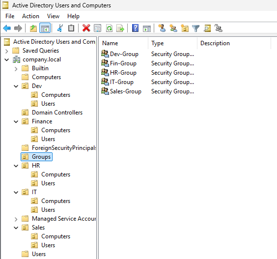

# **Group Policy Management** 

## **Password and Lockout Policies**

- Configure password policy:

  - Maximum password age: **60 days**

  - Minimum password length: **8 characters**

  - Password complexity: **Enabled**

  - Password history: **Remember last 5 passwords**

- Configure account lockout policy:

  - Lock account after **5 wrong password attempts**

  - Lockout duration: **45 minutes**

**<u>Password Policy</u>**

Group Policy Management 🡪 Right-click on the domain 🡪 Create a GPO 🡪 GPO Name: PasswordPolicy

Right-click on the PasswordPolicy 🡪 Click on Enforced

Right-click on the PasswordPolicy 🡪 Click on Edit

Computer Configuration 🡪 Policies 🡪 Windows Settings 🡪 Security Settings 🡪 Account Policies 🡪 Password Policy

- Maximum password age: 60 Days

- Minimum password age: 0 Day

- Password must meet complexity requirements: Enable

- Enforce password history: 5 passwords remembered

**<u>Lockout Policy</u>**

Group Policy Management 🡪 Right-click on the PasswordPolicy 🡪 Click on Edit

Computer Configuration 🡪 Policies 🡪 Windows Settings 🡪 Security Settings 🡪 Account Policies 🡪 Account Lockout Policy

- Account lockout threshold: 5 invalid logon attempts

- Account lockout duration: 45 minutes

- Reset account lockout counter after: 45 minutes

**🡺 CMD: gpupdate /force**

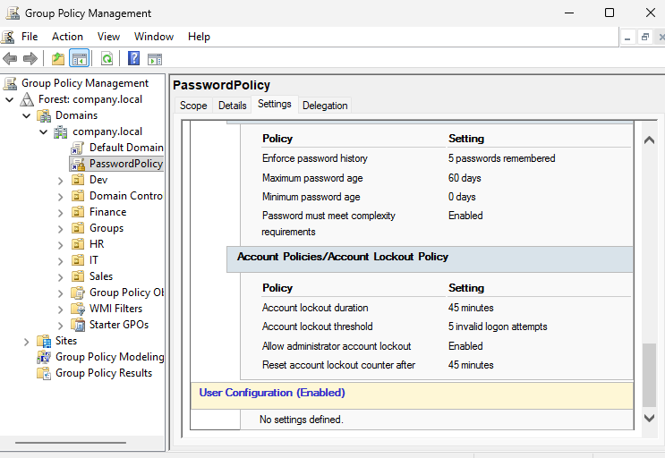

## **Enabling RDP for Remote Desktop Connection**

- Enable **Remote Desktop** for all domain computers using Group Policy.

Group Policy Management 🡪 Right-click on the domain 🡪 Create a GPO 🡪 GPO Name: RemoteDesktop

Right-click on the RemoteDesktop 🡪 Click on Enforced

Right-click on the RemoteDesktop 🡪 Click on Edit

Computer Configuration 🡪 Polices 🡪 Administrative Templates 🡪 Windows Components

Remote Desktop Services 🡪 Remote Desktop Session Host

- Connections

  - Allow users to connect remotely by using Remote Desktop Services: Enabled

- Security

  - Require user authentication for remote connections by using Network Level Authentication: Disabled

***NLA is only disabled for this lab it’s dangerous to disable it in real world***

- Return to: Policies 🡪 Windows Settings 🡪 Security Settings 🡪 Windows Defender Firewall

  - Windows Defender Firewall 🡪 Inbound Rules 🡪 Right-click 🡪 Click on New Rule

  - Predefined: Remote Desktop 🡪 Allow the connection ✔️

**🡺 CMD: gpupdate /force**

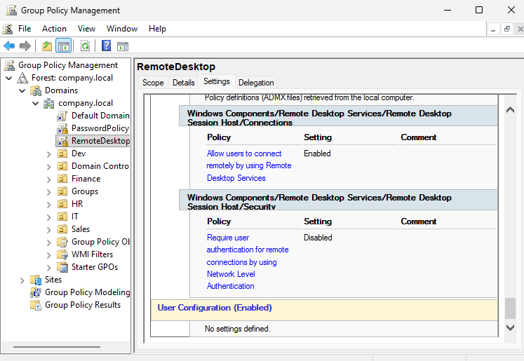

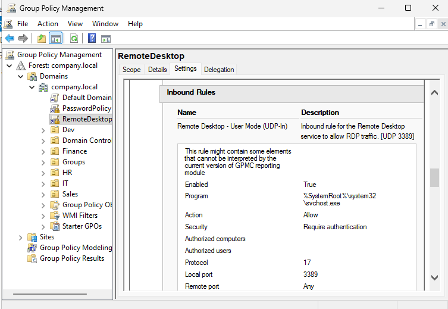

## **Enabling** **Remote Assistance**

- Allow **Remote Assistance** for all computers and assign the **IT Support Group** as helpers.

*🡺 **Add the feature: Remote Assistance before creating the GPO***

Group Policy Management 🡪 Right-click on the domain 🡪 Create a GPO 🡪 GPO Name: RemoteAssistance

Right-click on the RemoteAssistance 🡪 Click on Enforced

Right-click on the RemoteAssistance 🡪 Click on Edit

Computer Configuration 🡪 Policies 🡪 Administrative Templates 🡪 System 🡪 Remotes Assistance

- Configure Offer Remote Assistance: Enabled \| Allow helpers to remotely control the computer

  - Helpers: COMPANY\IT-Group

- Configure Solicited Remote Assistance: Enabled \| Allow helpers to remotely control the computer

  - Maximum ticket time (value): 1

  - Maximum ticket time (units): Hours

  - Method for sending email invitations: Simple MAPI

- Return to: Policies 🡪 Windows Settings 🡪 Security Settings 🡪 Security Options

  - User Account Control: Allow UIAccess applications to prompt…: Enabled

- Return to: Policies 🡪 Windows Settings 🡪 Security Settings 🡪 Windows Defender Firewall

  - Windows Defender Firewall 🡪 Inbound Rules 🡪 Right-click 🡪 Click on New Rule

  - Predefined: Remote Assistance 🡪 Allow the connection ✔️

**🡺 CMD: gpupdate /force**

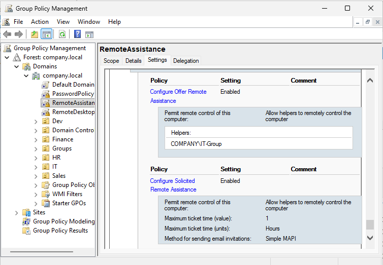

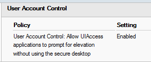

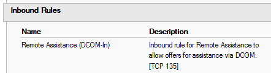

## **Prohibiting access to Removable Storage, Task Manager and Control Panel**

- Prohibit access to:

  - External/removable storage

  - Task Manager

  - Control Panel

Group Policy Management 🡪 Right-click on the domain 🡪 Create a GPO 🡪 GPO Name: ProhibitAccess

Right-click on the ProhibitAccess 🡪 Click on Enforced

Right-click on the ProhibitAccess 🡪 Click on Edit

- External/removable storage

  - User Configuration 🡪 Administrative Templates 🡪 System 🡪 Removable Storage Access

    - All Removable Storage classes: Deny all access: Enabled

- Task Manager

  - User Configuration 🡪 Administrative Templates 🡪 System 🡪 Ctrl+Alt+Del Options

    - Remove Task Manager: Enabled

- Control Panel

  - User Configuration 🡪 Administrative Templates 🡪 Control Panel

    - Prohibit access to Control Panel and PC settings: Enabled

<!-- -->

- Except the IT Group from this policy:

  - ProhibitAccess 🡪 Delegation 🡪 Advanced 🡪 Add: IT-Group 🡪 Apply group policy: Deny ✔️

**🡺 CMD: gpupdate /force**

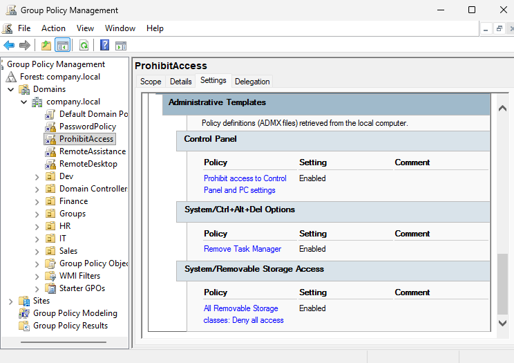

# **Configuring DHCP**

## **DHCP Scope**

- Create DHCP scope:

  - Scope range: **192.168.50.50 – 192.168.50.220**

  - Excluded range: **192.168.50.80 – 192.168.50.90**

  - Lease duration: **8 days**

- Configure DHCP failover between **PDC** and **ADC-CORE**.

*🡺 **Add the role: DHCP Server***

**­­­**

DHCP 🡪 pdc.company.local 🡪 Right-click on IPv4: New Scope

- Name: Class-C-50

- Description: Class C 192.168.50.0/24

- Start IP address: 192.168.50.50

- End IP address: 192.168.50.220

- Length: 24

- Subnet mask: 255.255.255.0

- Excluded address range: 192.168.50.80 – 192.168.50.90

- Lease Duration: 8 Days

- Yes, I want to configure these options now ✔️

- Router (Default Gateway): 192.168.50.1

- Parent domain: company.local

- DNS: 1) 192.168.50.10 \| 2) 192.168.50.11

- WINS Servers (Skip)

- Yes, I want to activate this scope now ✔️

Verify:

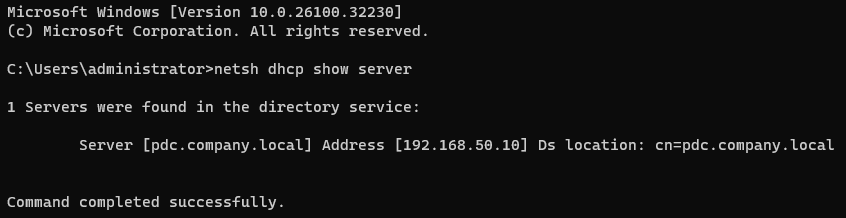

## **DHCP Failover**

- Configure DHCP failover between **PDC** and **ADC-CORE**.

*🡺 **Add the role: DHCP Server for ADC-CORE***

Right-click on DHCP 🡪 Click on Add Server 🡪 This authorized DHCP server:

| Name                   | IP Address    |
|------------------------|---------------|
| adc-core.company.local | 192.168.50.11 |

Right-click on adc-core.company.local 🡪 Authorize

This command is used on the ADC-CORE if the authorization is not working: **Restart-Service DHCPServer**

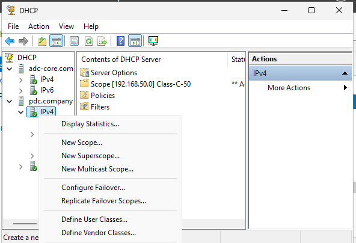

- Click on Configure Failover

  - Partner server: ADC-CORE

  - Relationship Name: pdc.company.local-adc-core.company.local

  - Maximum Client Lead Time: 1 Hour

  - Mode: Hot standby (Acitve-Passive)

  - Role of Partner Server: Standby

  - Addresses reserved for standby server: 5%

  - Enable Message Authentication (uncheck)

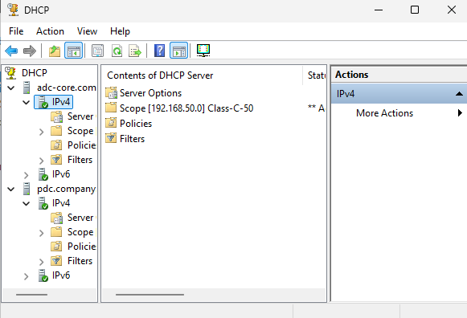

# **Web Server Internet Information Services (IIS)**

- Install **IIS Web Server** on both PDC and ADC-CORE with the default IIS page.

*🡺 **Add the role: Web Server (IIS) for both PDC and ADC-CORE***

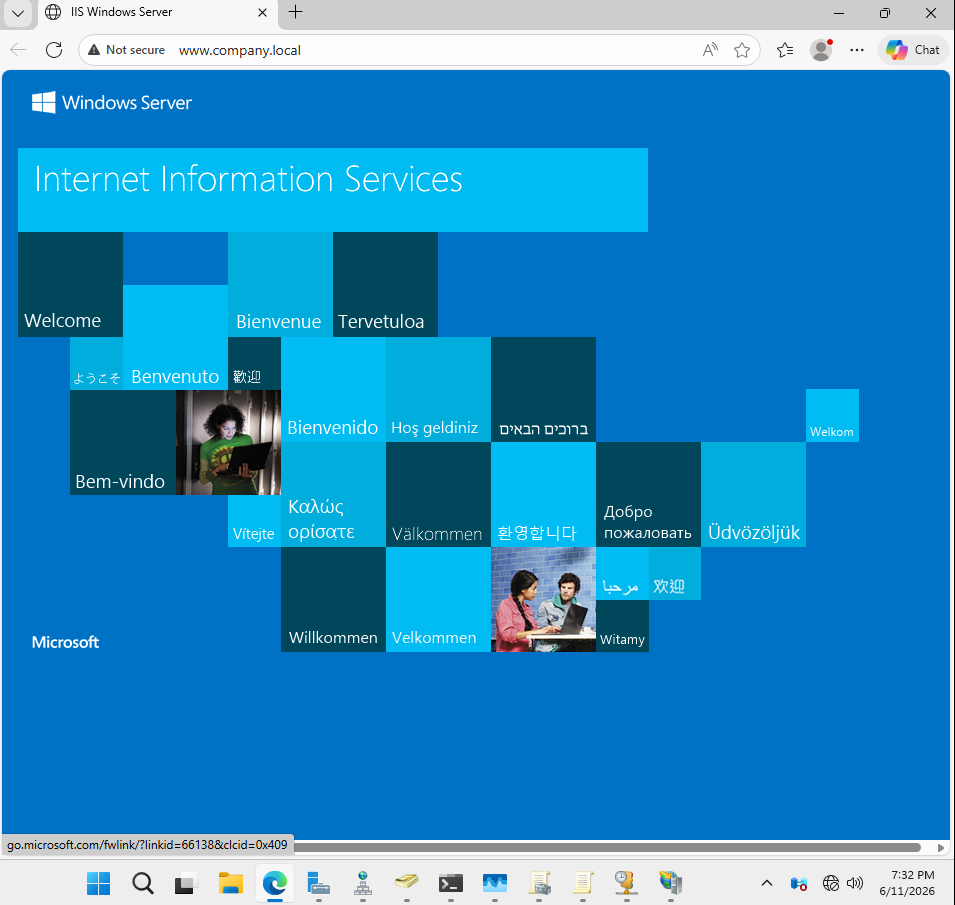

# **Sharing and File Server Resource Manager (FSRM)**

- Create shared folders for **HR** and **Dev**:

  - Users can create and edit files.

  - Users cannot delete files.

  - Block audio, video, and executable files.

First, we will add a new disk (HR and Dev) with the letter (E:)

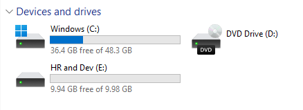

We will add two folders one for HR and one for Dev

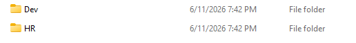

- Right-click on Dev 🡪 Properties 🡪 Sharing 🡪 Advanced Sharing

  - Share this folder ✔️

  - Permissions 🡪 Remove Everyone 🡪 Add: Domain Admins \| Allow: Full Control

  - Add 🡪 Dev-Group 🡪 Allow: Read and Change

- Right-click on Dev 🡪 Properties 🡪 Security 🡪 Advanced

  - Disable inheritance: Convert inherited permissions into explicit permissions on this objects

  - Add 🡪 Select a principal 🡪 Dev-Group 🡪 Type: Deny \| Applies to This folder, subfolders and files

  - Show advanced permissions 🡪 Check: Delete and Delete subfolders and files

  - Add 🡪 Select a principal 🡪 Dev-Group 🡪 Type: Allow \| Applies to This folder, subfolders and files

  - Show advanced permissions 🡪 Check: Traverse folder / execute files, List folder / read data, Read attributes, Read extended attributes, Create files / write data, Create folders / append data, Write attributes, Write extended attributes and Read permissions

*Same thing for HR.*

***🡺 Add the role: File Server Resource Manager***

- FSRM 🡪 File Screening Management 🡪 File Screens

  - File screen path: E:\Dev

  - Click on Custom Properties 🡪 Check: Audio and Video Files and Executable Files

  - Check Active screening: Do not allow users to save unauthorized files

  - Save without making a template ✔️

*Same thing for HR.*

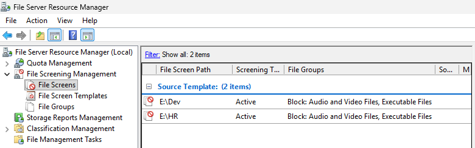

# **Map Network Drive**

- Create mapped network drives for **HR** and **Dev** departments using Group Policy.

<!-- -->

- Group Policy Management 🡪 Right-click on Dev 🡪 Create a GPO 🡪 New GP0

  - Name: MapNetworkDriveDev

  - Right-click on MapNetworkDriveDev then click on Edit

  - User Configuration 🡪 Preferences 🡪 Windows Settings 🡪 Drive Maps

  - Right-click 🡪 New 🡪 Mapped Drive

  - Action: Update \| Location: \\PDC\Dev \| Drive Letter: D 🡪 Apply

*Same thing for HR.*

**🡺 CMD: gpupdate /force**

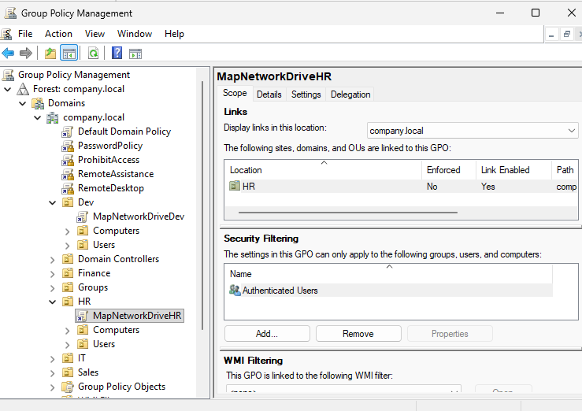

Note: To enable IPv4/6 ICMP and Sharing we have to add a GPO for that

- Right-click on the domain 🡪 Create a GPO

  - Name: FileSharingAndICMP

  - Right-click on FileSharingAndICMP 🡪 Enforced

  - Right-click on FileSharingAndICMP 🡪 Edit

  - Computer Configuration 🡪 Windows Settings 🡪 Windows Defender Firewall

  - Windows Defender Firewall 🡪 Inbound Rules

  - Right-click 🡪 New Rule

  - Predefined: File and Printer Sharing

  - Uncheck ICMPv6 if you don’t use it

  - Allow the connection ✔️

🡺 **CMD: gpupdate /force**

# **Public Shared Folder and Quota**

- Create a public shared folder for all domain users:

  - All domain users can edit.

  - Each user has a maximum quota of **2 GB**.

First, we will add a new disk (Public) with the letter (F:)

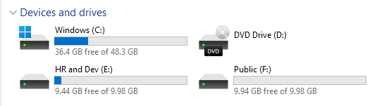

We will add a folder called Public

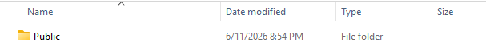

We will make the same steps that we did in the **Sharing and File Server Resource Manager (FSRM)** and

**Map Network Drive**, but there we will add Domain Users for the Sharing and we will add the GPO for the whole domain not a specific OU.

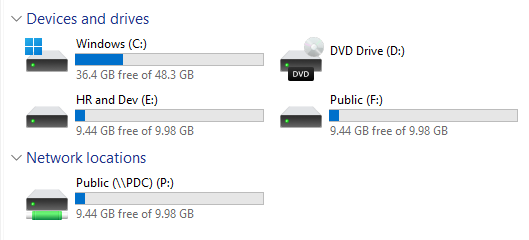

Quota configuration for the Public disk from PDC:

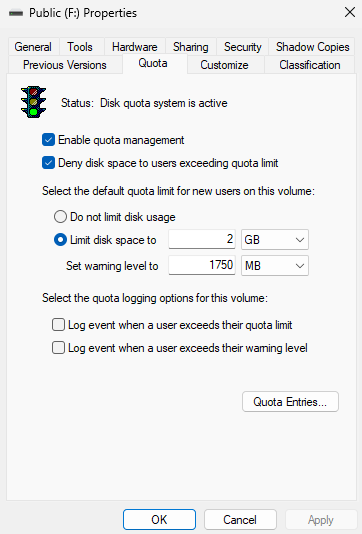

# **Printer Configuration** 

- Add a printer for all domain users:

  - Black and white printing only.

  - Printer available from **9:00 AM to 4:00 PM** only.

***🡺 Add the role: Print and Document Services \| Check: Print Server and Internet Printing***

- Print Management 🡪 Print Servers 🡪 PCD (local) 🡪 Printers

  - Right-click 🡪 Add Printer

  - Add a new printer using an existing port: LPT1: (Printer Port)

  - Install a new driver ✔️

  - Generic 🡪 MS Publisher Color Printer ✔️

  - Printer Name: Company Printer

- Right-click on Company Printer 🡪 Properties

  - Preferences 🡪 Paper/Quality 🡪 Black & White ✔️

  - Sharing 🡪 Share this printer ✔️

  - Security 🡪 Remove Everyone

  - Security 🡪 Add: Domain Users \| Allow: Print

  - Advanced 🡪 Available from 9:00 AM To 4:00 PM

- Right-click on Company Printer 🡪 Deploy with Group Policy

  - Check: The users that this GPO applies to (per user)

  - Then click on Add after adding DeployPrinter GPO

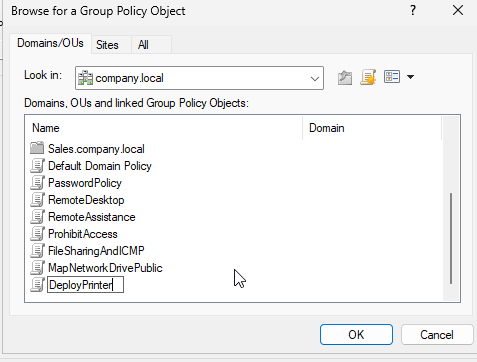

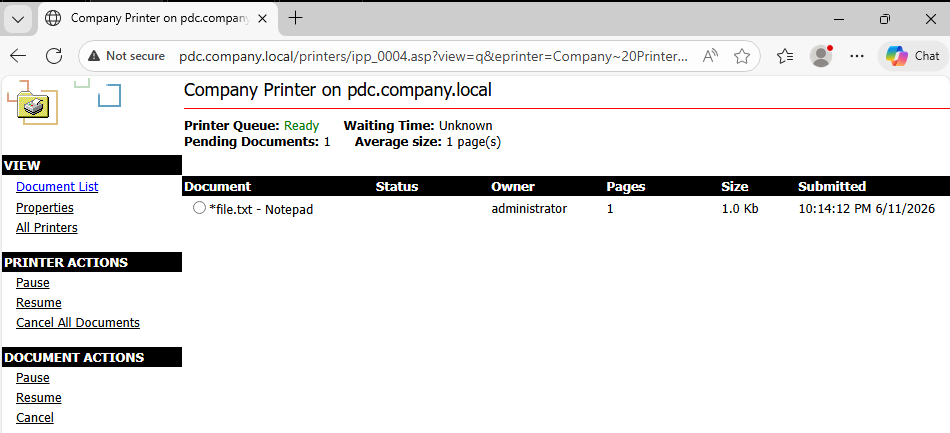

# **Active Directory Administrative Center - Active Directory Recycle Bin** 

Enable **Active Directory Recycle Bin**.

- Active Directory Administrative Center 🡪 company (local)

  - Enable Recycle Bin ✔️

*Now we can find deleted objects in Deleted Objects.*

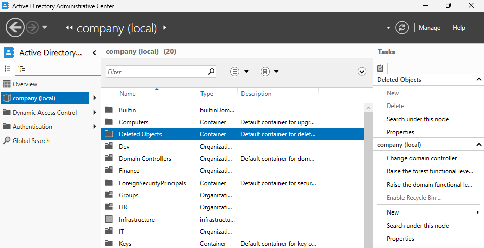

# **Virtualization with Hyper-V**

- Install **Hyper-V role** on PDC and ADC-CORE.

  - Create a Windows Server Core VM on PDC named **CORE-VM01**.

  - Configure **Hyper-V Replica** from PDC to ADC-CORE for CORE-VM01.

  - Join client machines to the domain.

## **Installing Hyper-V**

Note: for VMware users we must enable Virtualize Intel VT-x/EPT or AMD-V/RVI from:

Virtual Machine Settings 🡪 Hardware 🡪 Processors 🡪 Virtualize Intel VT-x/EPT or AMD-V/RVI ✔️

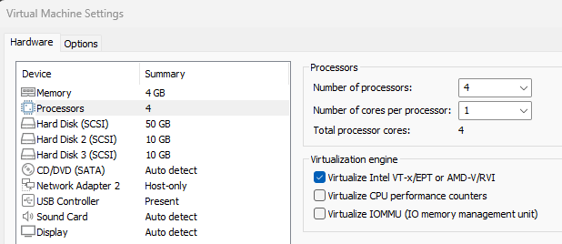

***🡺 Add the role: Hyper-V \| for both PDC and ADC-CORE***

- Virtual Switches 🡪 Check your host-only local network adapter

- Migration 🡪 Don’t check allow. We can add it later

- Default Stores 🡪 Preferred to use a separated disk for this

- Restart

- Installing Hyper-V on ADC-CORE by CMD:  
  **Install-WindowsFeature -Name Hyper-V -IncludeAllSubFeature**

> **shutdown /r**

- Hyper-V Manager 🡪 Right-click on Hyper-V Manager 🡪 Connect to Server

  - Add ADC-CORE

***NOW RECONFIGURE THE NETWORK ADAPTER (HYPER-V CHANGED NETWORK ADAPTER CONFIGURATION)***

## **Creating Windows Server VM in Hyper-V**

Before adding the virtual machine, we have to make sure that we configured the Virtual Switch Manager of the Hyper-V Manager for our both servers correctly (we have to use “External network” option in our case).

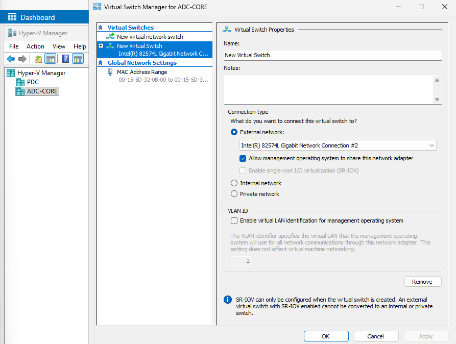

- Right-click on PDC 🡪 New 🡪 Virtual Machine

  - Name: CORE-VM01

  - Generation 2 ✔️

  - Startup memory: 1024 MB \| Use Dynamic Memory for this virtual machine ✔️

  - Connection: Virtual Switch

  - VHD Size: 20 GB

  - Installation Options: CD/DVD-ROM 🡪 Image file (.iso) 🡪 Windows Server ISO

- Right-click on CORE-VM01

  - Connect

  - Click on start and hold Enter

***IF THERE IS AN ERROR WITH MEMORY THEN ADD MORE MEMORY TO THE VM***

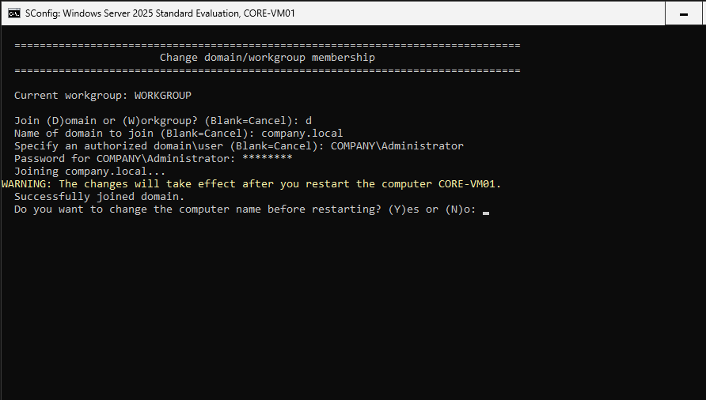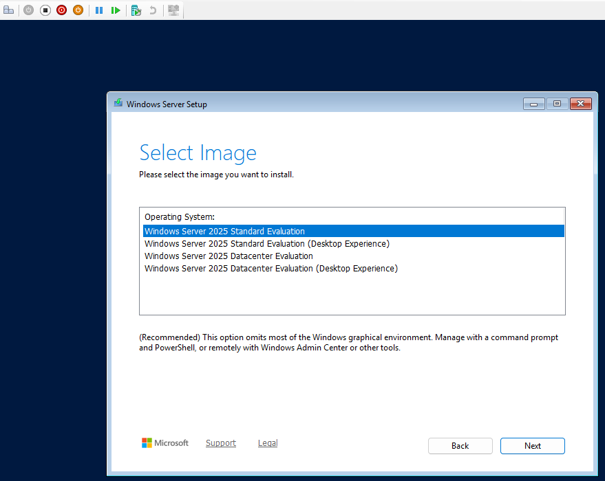

After completing the installation we will configure it like a normal Window Server Core with **sconfig** and join it to domain

## **Configuring Hyper-V Replica**

Before this process we have to make sure that the CORE-VM01 is turned off and we have to configure the replication settings for both PDC and ADC-CORE. For this lab I used Kerberos HTTP for the replication but in real world it is better to use HTTPS for security.

- Right-click on CORE-VM01 🡪 Enable Replication

  - Replica server: ADC-CORE

  - Authentication Type: Kerberos authentication (HTTP)

  - VHD: Choose the path of the .vhdx file for your VM

  - Replication Frequency: 30 seconds

  - Maintain only the latest recovery points ✔️

  - Send initial copy over the network ✔️

  - Start replication immediately ✔️

- Enable Hyper-V Replica HTTP Listener (TCP-In from) Windows Firewall Defender

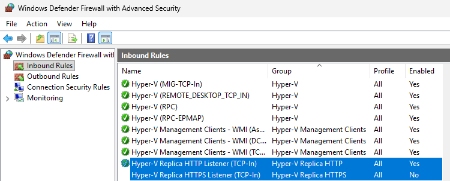

- Right-click on CORE-VM01 🡪 Enable Replication

  - Replication 🡪 Planned Failover

  - Start the Replica virtual machine after failover ✔️

Now Hyper-V Replica is enabled successfully

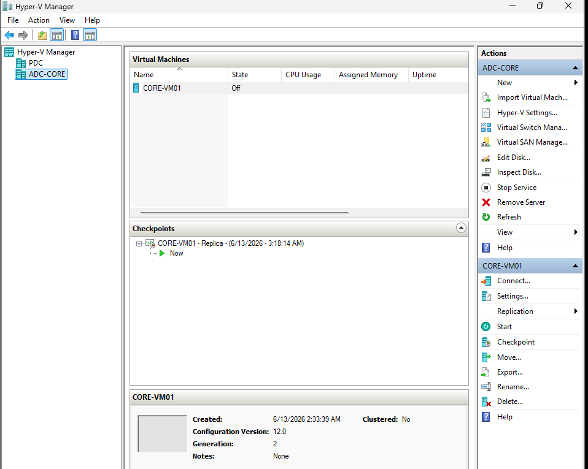

# **Windows Server Backup**

- Create a System state backup every day at **11:00 PM** for PDC, and save the backup destination on ADC-CORE.

***🡺 Add the feature: Windows Server Backup \| for both PDC and ADC-CORE***

- Windows Server Backup on PDC 🡪 Right-click on Local Backup 🡪 Backup Schedule

  - Backup Configuration: Custom

  - Add Items: System state

  - Backup Time: Once a day ✔️ \| 11:00 PM

  - Destination Type: Back up to a shared network folder ✔️

  - Location: \\ADC-CORE.company.local\backup (I have already shared this on ADC-CORE)

Now the backup is created successfully

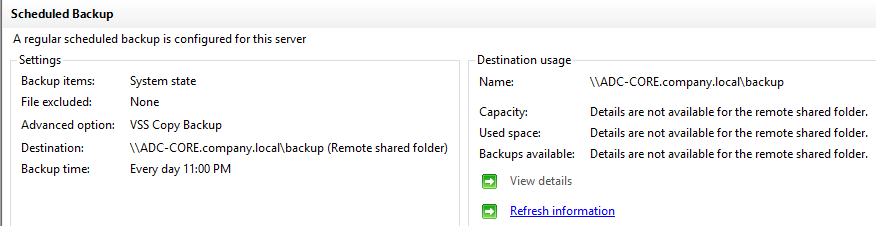

# **Windows Deployment Services**

- Install and configure **WDS** on **PDC**.

  - Add a Windows boot image and install image to WDS.

  - Test PXE boot from one client computer.

  - Deploy Windows to one test client using WDS.

Note: WDS is deprecated on Windows 11 and now there are other tools used for Windows Deployment for more details read this article by Microsoft: <https://learn.microsoft.com/en-us/windows/deployment/wds-boot-support>

**I WILL USE WDS JUST TO SHOW THE SERVICE FOR THIS LAB**

***🡺 Add the role: Windows Deployment Services on PDC***

- Windows Deployment Services 🡪 Servers 🡪 Right-click on PDC.company.local 🡪 Configure Server

  - Install Options: Integrated with Active Directory ✔️

  - Remote Installation Folder Location: choose the path where the ISO image is in

  - Do not listen on DHCP and DHCPv6 ports ✔️

  - Configure DHCP options for Proxy DHCP ✔️

  - PXE Server Initial Settings

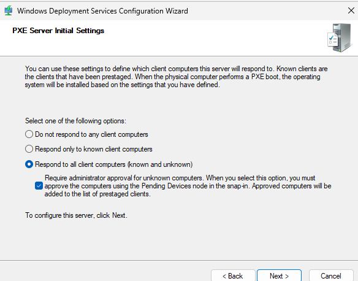

- Windows Deployment Services 🡪 Servers 🡪 PDC.company.local 🡪 Install Images

  - Right-click 🡪 Add Install Image

  - Create an image group named: Windows

  - File location: \sources\install.wim

  - Windows 11 Pro ✔️

- Windows Deployment Services 🡪 Servers 🡪 PDC.company.local 🡪 Boot Images

  - Right-click 🡪 Add Boot Image

  - File location: \sources\boot.wim

- Windows Deployment Services 🡪 Servers 🡪 Right-click on PDC.company.local 🡪 Properties

  - Boot 🡪 Check these two options:

  - Known clients: Continue the PXE boot unless the user presses the ESC key

  - Unknown clients: Continue the PXE boot unless the user presses the ESC key

Testing the WDS on a virtual machine that do not have an ISO image

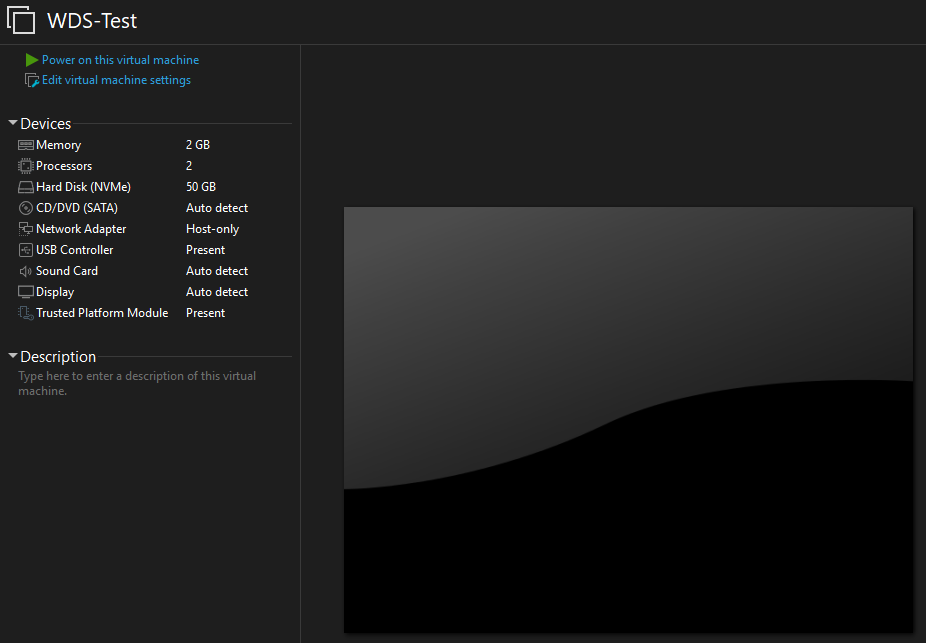

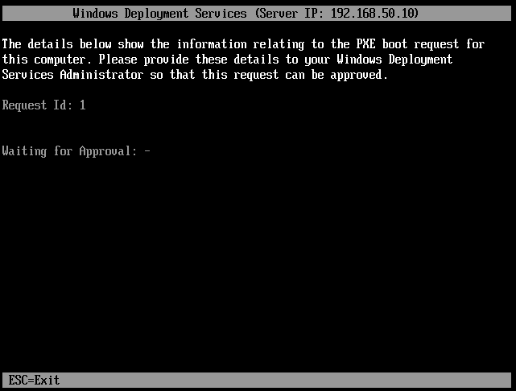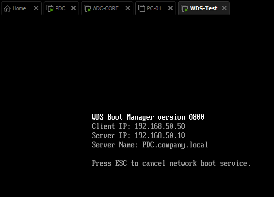

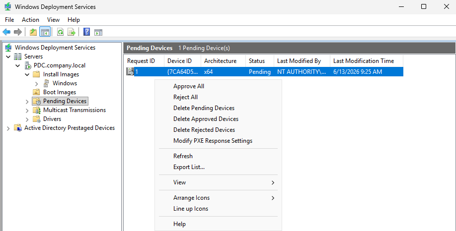

# **Windows Server Update Services**

- Install and configure **WSUS** on **PDC**.

  - Configure WSUS to download updates for Windows Server and Windows 11.

  - Create a GPO to point clients to the WSUS server.

  - Test updates on one client computer.

***🡺 Add the role: Windows Server Update Services on PDC***

- Don’t choose SQL Server Connectivity

- Choose the path where updated will be stored in

<!-- -->

- Windows Server Update Services (Configuration Wizard)

  - Synchronize from Microsoft Updates ✔️

  - Start Connecting ✔️ **(YOU MUST HAVE INTERNET CONNECTION)**

  - Choose Products and Classifications required

  - Update Languages: English ✔️

  - Computers: Use the Update Services console ✔️

<!-- -->

- Group Policy Management 🡪 Right-click on domain 🡪 Create a GPO 🡪 Name: WSUS

  - Right-click on WSUS 🡪 Enforced \| Edit

  - Computer Configuration 🡪 Policies 🡪 Administrative Templates 🡪 Windows Components

  - Windows Update 🡪 Manage end user experience 🡪 Configure Automatic Updated

    - Enabled ✔️ \| Auto download and notify for install ✔️

    - Install during automatic maintenance ✔️ \| 0 – Every day \| 23:00

  - Windows Update 🡪 Manage updates offered from Windows Server Update Service

  - Click on Specify intranet Microsoft update service location

    - Enabled ✔️

    - http://pdc

Now the service is ready!

# **Transfer and Seize FSMO Master Roles (Explain)**

- Explain how to **transfer** and **seize** **FSMO Master Roles**.

FSMO roles are special Active Directory roles assigned to specific Domain Controllers. The five FSMO roles are **Schema Master**, **Domain Naming Master**, **RID Master**, **PDC Emulator**, and **Infrastructure Master**.

First, check the current FSMO role holders:

netdom query fsmo

**Transfer FSMO Roles**

A **transfer** is used when the current FSMO role holder is online and working. Open CMD as Administrator and run:

**ntdsutil**

**roles**

**connections**

**connect to server ADC-CORE**

**quit**

**transfer schema master**

**transfer naming master**

**transfer rid master**

**transfer pdc**

**transfer infrastructure master**

**quit**

**quit**

Replace DC2 with the Domain Controller that will receive the FSMO roles.

**Seize FSMO Roles**

A **seize** is used only when the old FSMO role holder has failed and cannot be recovered. Run:

**ntdsutil**

**roles**

**connections**

**connect to server ADC-CORE**

**quit**

**seize schema master**

**seize naming master**

**seize rid master**

**seize pdc**

**seize infrastructure master**

**quit**

**quit**

After transferring or seizing, verify the FSMO roles again:

**netdom query fsmo**

**Note:** Transfer FSMO roles when the old server is available. Seize FSMO roles only in emergency situations. After seizing, the failed old Domain Controller should not be brought back online without proper cleanup.

# **Verifying (Clients View)**

**DHCP**

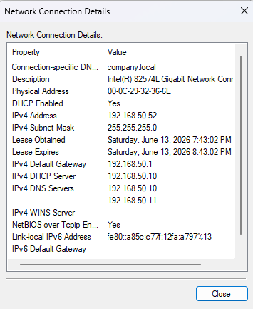

**Login to Active Directory**

System 🡪 About 🡪 Domain or workgroup 🡪 Change

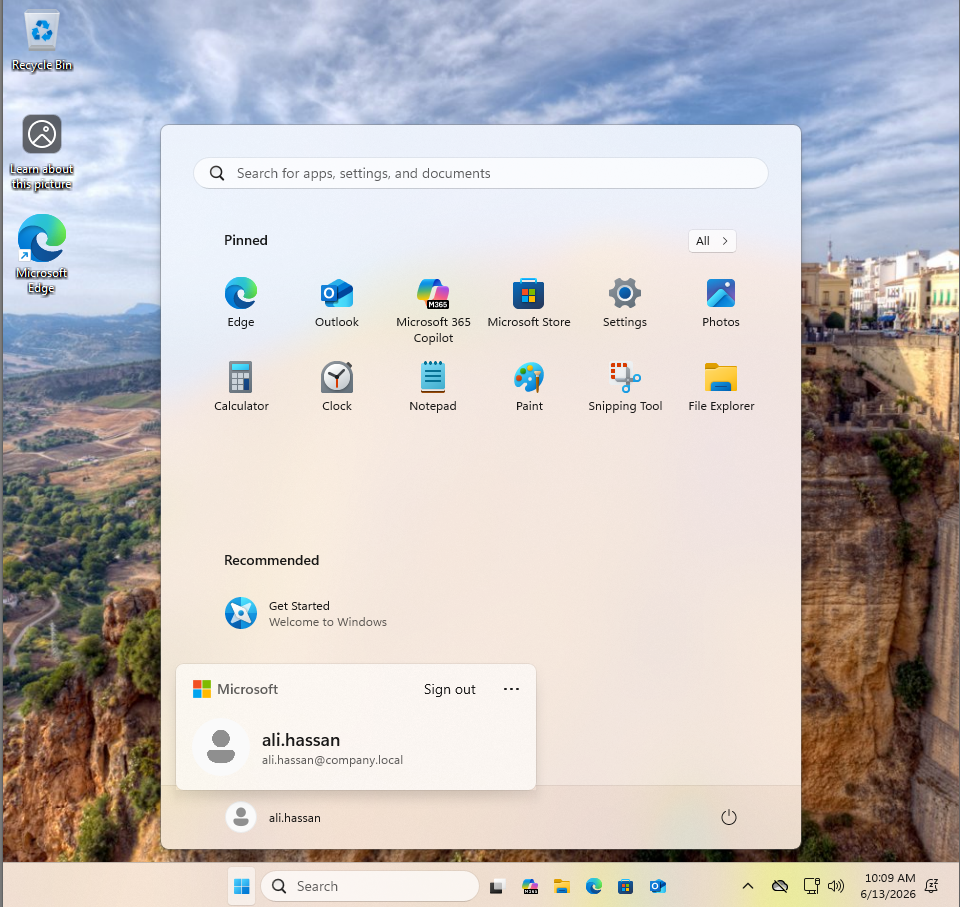

**Task Manager**

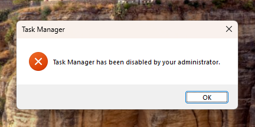

**Control Panel**

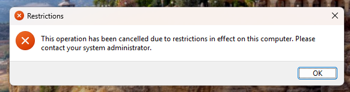

**Removable Storage**

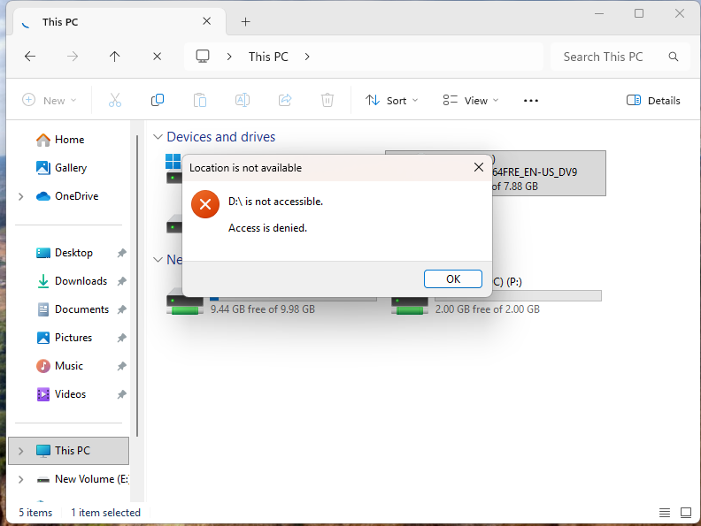

**Shared Files for HR and Public (I signed by Ali Hassan’s account who is HR)**

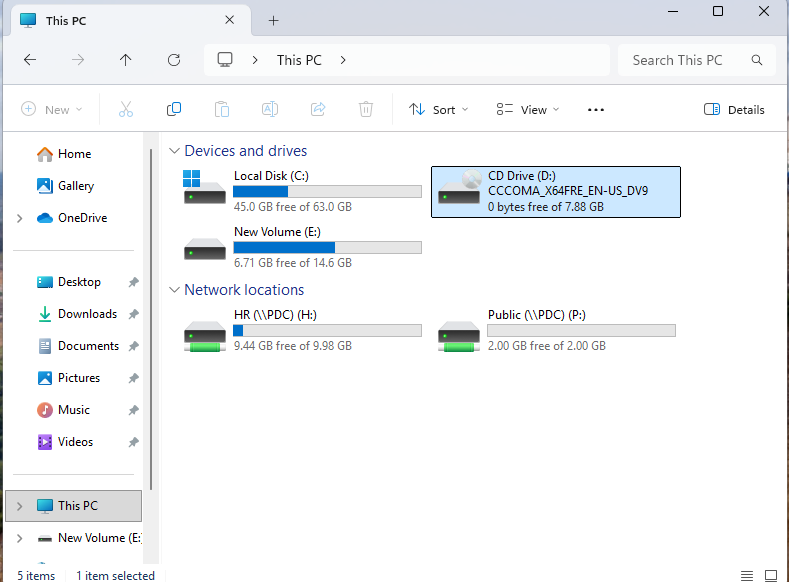

**Web Server (IIS)**

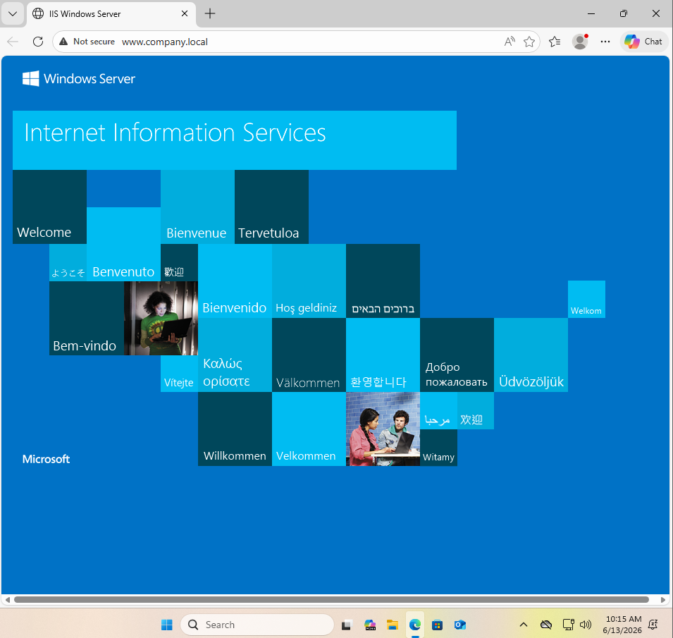

**DNS**

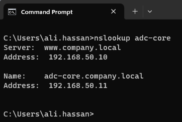

**RDP**

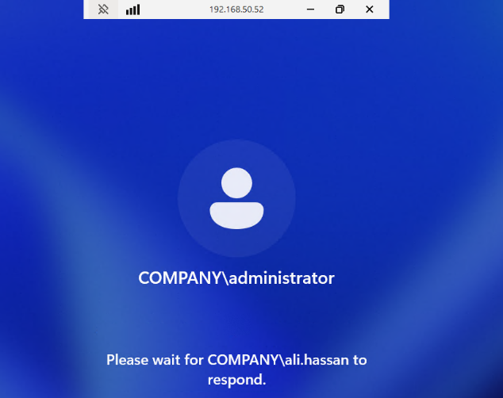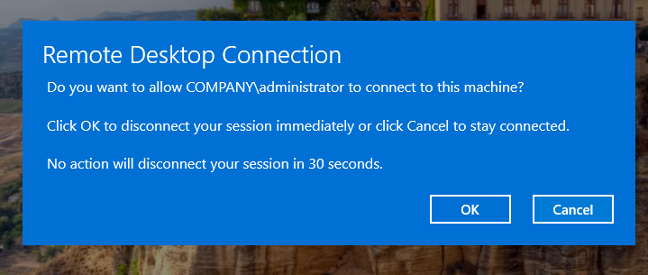

**Remote Assistance**

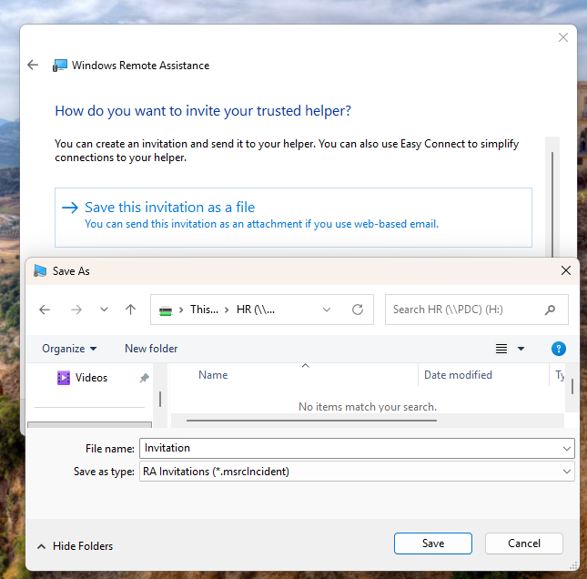

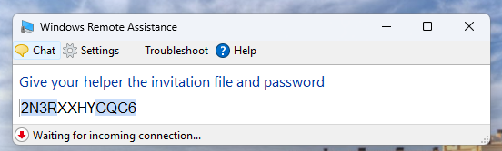

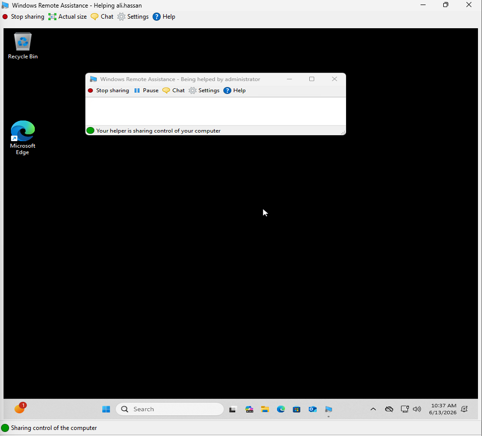

**Printer**

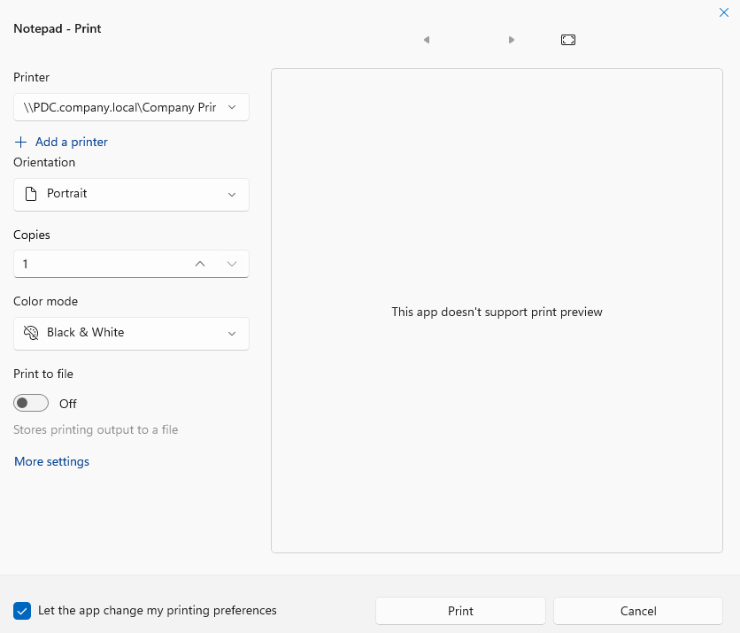

**File Screening**

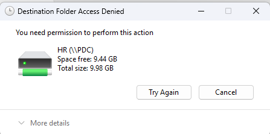

**Password Lockout**

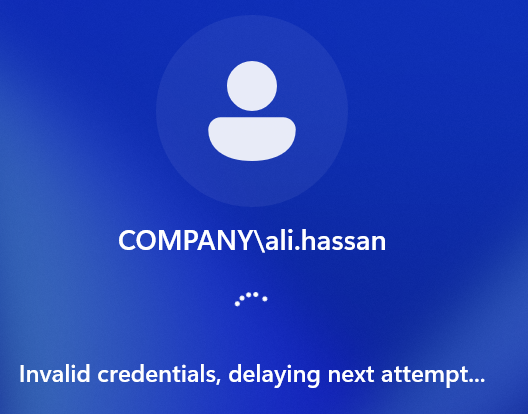

# **MESSAGE FOR YOU!**

***Thanks for reading the whole project :)***
